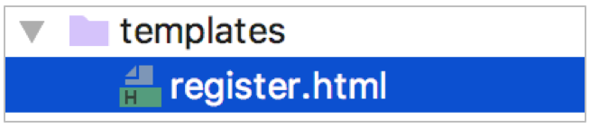

# User Registration
## 1. Show user registration page
### 1.1 Create User Module Sub-Applications
#### 1.1.1 Create
```bash
$ cd ~/projects/lemon_mall/lemon_mall/lemon_mall/apps
$ python3 ../../manage.py startapp users
```
#### 1.1.2 View the project guide package path
To know how to import the users application and complete the registration, we need to know the path to the project package.
 ```python
import sys

print(sys.path)
 ```
Known guide paths
 - `lemon_mall/lemon_mall`

Known directory for the 'users' application
 - `lemon_mall/lemon_mall/lemon_mall/apps/users`

Get the package path to import the 'users' app
 - `lemon_mall/apps/users`

#### 1.1.3 Registered User Module Sub-Application
```python
# dev.py
INSTALLED_APPS = [
    'django.contrib.admin',
    'django.contrib.auth',
    'django.contrib.contenttypes',
    'django.contrib.sessions',
    'django.contrib.messages',
    'django.contrib.staticfiles',
    
    # 'lemon_mall.apps.users'
    'users'
]
```
### 1.2 Append package path
 - Make registering for the users app even easier by registering directly with the app name `users`

Known guide paths
- `lemon_mall/lemon_mall`

Known directory for the 'users' application
- `lemon_mall/lemon_mall/lemon_mall/apps/users`

Requires a package guide path
- `lemon_mall/lemon_mall/lemon_mall/apps`

```python
import sys
import os
from pathlib import Path

BASE_DIR = Path(__file__).resolve().parent.parent
sys.path.insert(0, os.path.join(BASE_DIR, 'apps'))  # add new path


INSTALLED_APPS = [
    ...,
    'users'
]
```
### 1.3 Show user registration page
#### 1.3.1 Prepare user registration template files

```html
<head>
    <meta http-equiv="Content-Type" content="text/html;charset=UTF-8">
    <title>LemonMall Register</title>
    <link rel="stylesheet" type="text/css" href="{{ static('css/reset.css') }}">
    <link rel="stylesheet" type="text/css" href="{{ static('css/main.css') }}">
</head>
```
#### 1.3.2 Define the user registration view
```python
from django.views import View
from django.shortcuts import render

class RegisterView(View):
    """User Registration"""

    def get(self, request):
        """Provide user registration page"""
        return render(request, 'register.html')
```
#### 1.3.3 Define user registration routes
```python
# lemon_mall/urls.py
urlpatterns = [
    # users
    re_path(r'^', include('users.urls', namespace='users'))
]
```
```python
# users/urls.py
urlpatterns = [
    # User Registration: reverse(users:register) == '/register/'
    re_path(r'^register/$', views.RegisterView.as_view(), name='register'),
]
```
