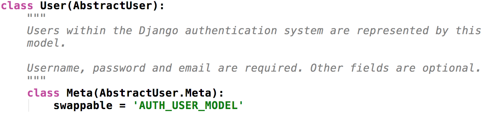
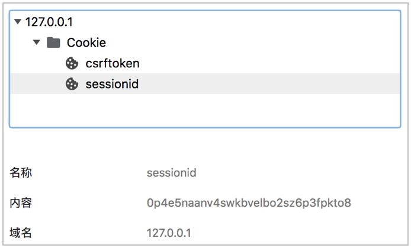
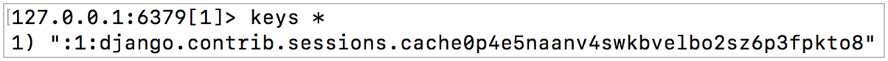

# User Registration
## 1. Show user registration page
### 1.1 Create User Module Sub-Applications
#### 1.1.1 Create
```bash
$ cd ~/projects/lemon_mall/lemon_mall/lemon_mall/apps
$ python3 ../../manage.py startapp users
```
#### 1.1.2 View the project guide package path
To know how to import the users application and complete the registration, we need to know the path to the project package.
 ```python
import sys

print(sys.path)
 ```
Known guide paths
 - `lemon_mall/lemon_mall`

Known directory for the 'users' application
 - `lemon_mall/lemon_mall/lemon_mall/apps/users`

Get the package path to import the 'users' app
 - `lemon_mall/apps/users`

#### 1.1.3 Registered User Module Sub-Application
```python
# dev.py
INSTALLED_APPS = [
    'django.contrib.admin',
    'django.contrib.auth',
    'django.contrib.contenttypes',
    'django.contrib.sessions',
    'django.contrib.messages',
    'django.contrib.staticfiles',
    
    # 'lemon_mall.apps.users'
    'users'
]
```
### 1.2 Append package path
 - Make registering for the users app even easier by registering directly with the app name `users`

Known guide paths
- `lemon_mall/lemon_mall`

Known directory for the 'users' application
- `lemon_mall/lemon_mall/lemon_mall/apps/users`

Requires a package guide path
- `lemon_mall/lemon_mall/lemon_mall/apps`

```python
import sys
import os
from pathlib import Path

BASE_DIR = Path(__file__).resolve().parent.parent
sys.path.insert(0, os.path.join(BASE_DIR, 'apps'))  # add new path


INSTALLED_APPS = [
    ...,
    'users'
]
```
### 1.3 Show user registration page
#### 1.3.1 Prepare user registration template files

```html
<head>
    <meta http-equiv="Content-Type" content="text/html;charset=UTF-8">
    <title>LemonMall Register</title>
    <link rel="stylesheet" type="text/css" href="{{ static('css/reset.css') }}">
    <link rel="stylesheet" type="text/css" href="{{ static('css/main.css') }}">
</head>
```
#### 1.3.2 Define the user registration view
```python
from django.views import View
from django.shortcuts import render

class RegisterView(View):
    """User Registration"""

    def get(self, request):
        """Provide user registration page"""
        return render(request, 'register.html')
```
#### 1.3.3 Define user registration routes
```python
# lemon_mall/urls.py
urlpatterns = [
    # users
    re_path(r'^', include('users.urls', namespace='users'))
]
```
```python
# users/urls.py
urlpatterns = [
    # User Registration: reverse(users:register) == '/register/'
    re_path(r'^register/$', views.RegisterView.as_view(), name='register'),
]
```
## 2. User model class
### 2.1 Define user model classes
#### 2.1.1 Django default user authentication system
Django comes with a user authentication system
 - It handles user accounts, groups, permissions, and cookie-based user sessions.

Django Authentication System Location
 - `django.contrib.auth` contains the core and default models for the authentication framework.
 - `django.contrib.contenttypes` is the Django content type system that allows permissions to be associated with the models you create.

Django authentication system handles both authentication and authorization
 - Authentication: verifies that a user is who it claims to be and can be used for account logins.
 - Authorization: Authorization determines what an authenticated user is allowed to do.

What the Django authentication system contains
 - Users: **user model classes**, user authentication.
 - Permission: identifies whether a user can do a specific task, commonly used in MIS systems.
 - Groups: Unified management of multiple users with the same permissions, commonly used in MIS systems.
 - Password: A configurable password hash system, setting passwords, password verification.

#### 2.1.2 Django default user model class
The Django authentication system provides a user model class User to hold data about users.
 - **The User object is the core of the authentication system.**

Django authentication system user model class location
 - **django.contrib.auth.models.User**

   

Introduction to the parent class **AbstractUser**
 - Basic properties of User object
   - Required to create a user (registered user): `username`, `password`
   - Create user (registered user) optional: `email`, `first_name`, `last_name`, `last_login`, `date_joined`, `is_active`, `is_staff`, `is_superuse`
   - Determine whether the user is authenticated (whether to log in): `is_authenticated`
 - Methods to create a user (registered user)
```python
user = User.objects.create_user(username, email, password, **extra_fields)
```
 - User authentication (user login) method
```python
from django.contrib.auth import authenticate
user = authenticate(username=username, password=password, **kwargs)
```
 - Methods for handling passwords
   - Set password: set_password(raw_password)
   - Check the password: check_password(raw_password)

#### 2.1.3 Custom User Model Classes
Why customize the user model class?

 - The user `mobile` information must be selected in the registration data of Lemon Mall.

 - However, there is no mobile field in the default Django user model class, so we need to customize the user model class.

How to customize the user model class?

 - Inherit from **AbstractUser**.
 - Add `mobile` field.

```python
from django.db import models
from django.contrib.auth.models import AbstractUser


# Create your models here.
class User(AbstractUser):
    """Custom User Model Classes"""
    mobile = models.CharField(max_length=11, unique=True, verbose_name='mobile')

    class Meta:
        db_table = 'tb_users'    # Custom Table Names
        verbose_name = 'User'   # User
        verbose_name_plural = verbose_name

    def __str__(self):
        return self.username
```

### 2.2 Migrate user model classes
#### 2.2.1 Specify the user model class
Why is Django's default user model class User?
 - 'django.conf.global_settings'
```python
AUTH_USER_MODEL = 'auth.User'
```
The Django user model class is determined by the global configuration item **AUTH_USER_MODEL**.

Configuration rules:
```python
AUTH_USER_MODEL = 'Application Name.Model Class Name'
```

```python
# Specify custom user model classes
AUTH_USER_MODEL = 'users.User'
```
#### 2.2.2 Migrate
```bash
$ python3 manage.py makemigrations
$ python3 manage.py migrate
```
## 3. User registration business realization
### 3.1 User registration interface design and definition
Request method

Option| Program
---|---|
Request Method|POST
Request address|/register/

Request parameters: form parameters

Parameter name | Type | Must be passed or not| Description 
---|---|---|---|
username|string|Yes|Username
password|string|Yes|Password
password2|string|Yes|Confirm password
mobile|string|Yes|cell phone number
sms_code|string|Yes|SMS_Code
allow|string|Yes|Agree to the User Agreement

Response result: HTML
 - register.html

Response results| Response content
---|---|
Registration Failure|Responding to Error Alerts
Successful registration|Redirect to home page

### 3.2 User registration front-end logic
#### 3.2.1 Vue data binding for user registration page
Prepare div box labels
```html
<div id="app">
    <body>
    ......
    </body>
</div>
```

register.html
```html
<form method="post" class="register_form" @submit="on_submit" v-cloak>
    {{ csrf_input }}
    ...
</form>
```

#### 3.2.2 User registration JS file to realize user interaction

Import Vue.js libraries and libraries for ajax requests
```html
<!-- register.html -->
<script type="text/javascript" src="{{ static('js/vue-2.5.16.js') }}"></script>
<script type="text/javascript" src="{{ static('js/axios-0.18.0.min.js') }}"></script>
```

Prepare the register.js file
```html
<!-- register.html -->
<script type="text/javascript" src="{{ static('js/register.js') }}"></script>
```
```js
// register.js
let vm = new Vue({
   ...
})
```

### 3.3 User registration backend logic
#### 3.3.1 Reception parameters
The user registration data is sent from the registration form, so it is extracted using `request.POST`.
```python
username = request.POST.get('username')
password = request.POST.get('password')
password2 = request.POST.get('password2')
mobile = request.POST.get('mobile')
allow = request.POST.get('allow')
```
#### 3.3.2 Calibration Parameters
The front-end calibrated back-end should also be calibrated, the back-end calibration and the front-end calibration are consistent.
```python
if not all([username, password, password2, mobile, allow]):
    return http.HttpResponseForbidden('缺少必传参数')
if not re.match(r'^[a-zA-Z0-9_-]{5,20}$', username):
    return http.HttpResponseForbidden('请输入5-20个字符的用户名')
if not re.match(r'^[0-9A-Za-z]{8,20}$', password):
    return http.HttpResponseForbidden('请输入8-20位的密码')
if password != password2:
    return http.HttpResponseForbidden('两次输入的密码不一致')
if not re.match(r'^1[3-9]\d{9}$', mobile):
    return http.HttpResponseForbidden('请输入正确的手机号码')
if allow != 'on':
    return http.HttpResponseForbidden('请勾选用户协议')
```
Here check the parameters, the front-end has been checked, if the parameters at this time or error, that the request is not the normal channel to send, so directly prohibit this request.
#### 3.3.3 Save registration data
Create a new user using the `create_user()` method provided by the Django Authentication System user model class.

The `create_user()` method encapsulates the `set_password()` method to encrypt the password.
```python
# Save registration data
try:
   user = User.objects.create_user(username=username, password=password, mobile=mobile)
except DatabaseError:
   return render(request, 'register.html', {'register_errmsg': '注册失败'})

# Respond to registration results
return http.HttpResponse('注册成功，重定向到首页')
```
#### 3.3.4 Respond to registration results
Successful registration, redirect to homepage.
1. Create a homepage ad application: contents
```bash
$ cd ~/projects/lemon_mall/lemon_mall/lemon_mall/apps
$ python3 ../../manage.py startapp contents
```
2. Define home page ad view: IndexView
```python
class IndexView(View):
    """首页广告"""

    def get(self, request):
        return render(request, 'index.html')
```
3. Configuring home page ad routing: binding namespaces
```python
# lemon_mall/urls.py
urlpatterns = [
    # users
    re_path(r'^', include('contents.urls', namespace='contents'))
]
```
```python
# contents/urls.py
urlpatterns = [
    # Home page advertisement
    re_path(r'^$', views.IndexView.as_view(), name='index')
]
```
4. Response to registration result: redirect to home page
```python
return redirect(reverse('contents:index'))
```

### 3.4 State maintenance
Successful registration means successful user login.
#### 3.4.1 Introduction to the login() method
1. User login essentials:
 - **State retention**
 - Writes unique identifying information (e.g., user ID) about an authenticated user to the current browser's cookie and the server's session.

2. login() method:
 - Django user authentication system provides `login()` method.
 - It encapsulates the operation of writing to a session, helping us to quickly log in a user and achieve state retention.

3. login() position:
```python
# django.contrib.auth.__init__.py
login(request, user, backend=None)
```

4. Location of stateful holding session data store: Redis database bank 1
```python
# dev.py
SESSION_ENGINE = "django.contrib.sessions.backends.cache"
SESSION_CACHE_ALIAS = "session"
```
#### 3.4.2 The login() method logs the user in
```python
try:
    user = User.objects.create_user(username=username, password=password, mobile=mobile)
except DatabaseError:
    return render(request, 'register.html', {'register_errmsg': '注册失败'})

# Realization of state retention
login(request, user)

return redirect(reverse('contents:index'))
```

#### 3.4.3 View status hold results



### 3.5 Duplicate user name registration
Request method

Option| Program
---|---|
Request Method|GET
Request address|/usernames/(?P<username>[a-zA-Z0-9_-]{5,20})/count/

Request parameters: path parameter

Parameter name | Type | Must be passed or not| Description 
---|---|---|---|
username|string|Yes|Username


Response result: JSON

Response results| Response content
---|---|
code|Status code
errmsg|Error message
count|Record the number of this username

Backend
```python
class UsernameCountView(View):

    def get(self, username):
        count = User.objects.filter(username=username).count()
        return http.JsonResponse({'code': RETCODE.OK, 'errmsg': 'OK', 'count': count})
```

Frontend
```html
if (this.error_name == false) {
    let url = '/usernames/' + this.username + '/count/';
    axios.get(url,{
        responseType: 'json'
    })
        .then(response => {
            if (response.data.count == 1) {
                this.error_name_message = '用户名已存在';
                this.error_name = true;
            } else {
                this.error_name = false;
            }
        })
        .catch(error => {
            console.log(error.response);
        })
}
```

### 3.6 Duplicate registration of cell phone number
Request method

Option| Program
---|---|
Request Method|GET
Request address|/mobiles/(?P<mobile>\+?(\d{1,3})?[- ]?(\d{9,11}))/count/

Request parameters: path parameter

Parameter name | Type | Must be passed or not| Description 
---|---|---|---|
mobile|string|Yes|Cell phone number


Response result: JSON

Response results| Response content
---|---|
code|Status code
errmsg|Error message
count|Record the number of this username

Backend
```python
class MobileCountView(View):

   def get(self, mobile):
      count = User.objects.filter(mobile=mobile).count()
      return http.JsonResponse({'code': RETCODE.OK, 'errmsg': 'OK', 'count': count})
```

Frontend
```html
if (this.error_mobile == false) {
   let url = '/mobiles/'+ this.mobile + '/count/';
      axios.get(url, {
        responseType: 'json'
      })
      .then(response => {
        if (response.data.count == 1) {
            this.error_mobile_message = '手机号已存在';
            this.error_mobile = true;
      } else {
        this.error_mobile = false;
      }
      })
      .catch(error => {
        console.log(error.response);
   })
}
```