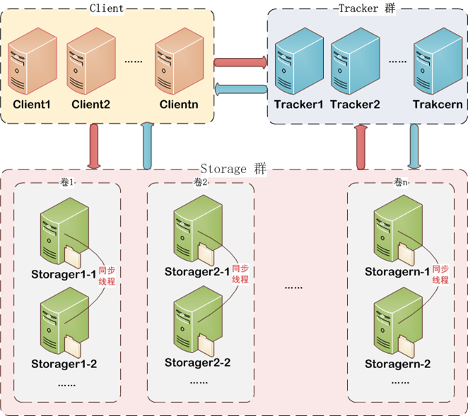
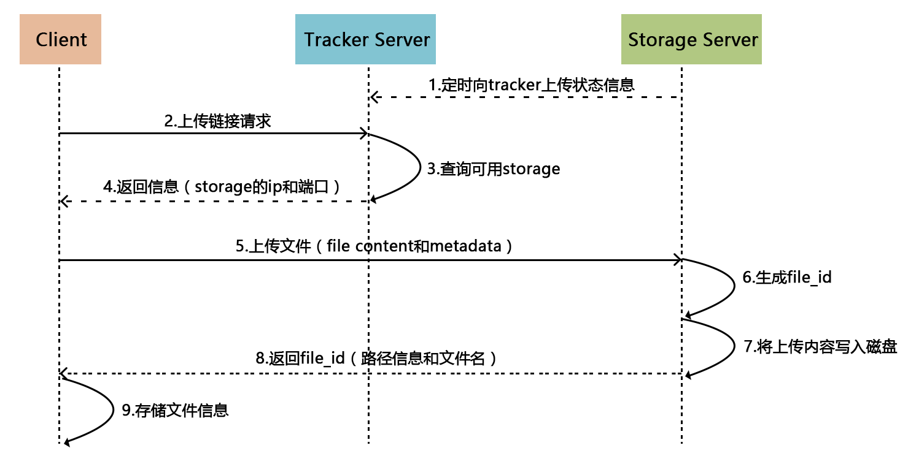
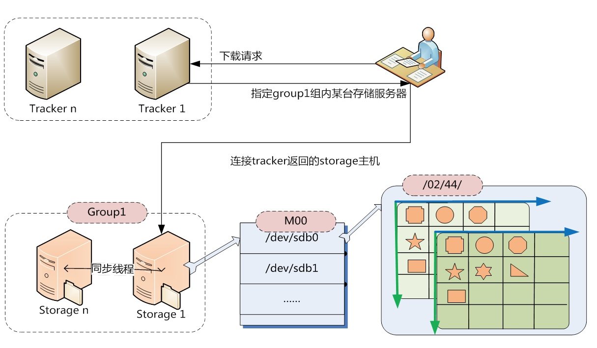
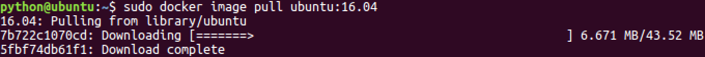
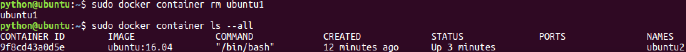
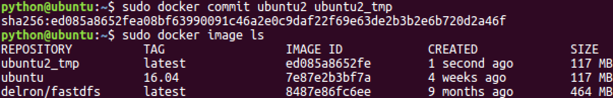
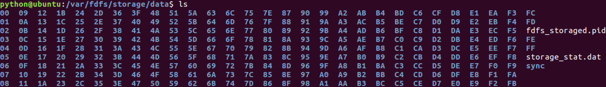
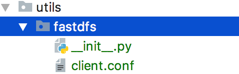

# Product

## 1. Product database table design
### 1.1 SPU and SKU

For merchandise in e-commerce, there are two important concepts: the SPU and the SKU.

#### 1.1.1 Introduction to SPU

**SPU = Standard Product Unit**
 - SPU is the smallest unit of commodity information aggregation, is a set of standardized information that can be taken, easy to retrieve the collection, the collection describes the characteristics of a product.

 - In common parlance, goods with the same attribute values and characteristics can be categorized into one type of SPU.

 - Example:
   - iPhone X is an SPU, independent of merchant, color, style, specification, package, etc.
      

#### 1.1.2 Introduction to SKU

**SKU = Stock Keeping Unit**
 - SKU, the unit of measurement of inventory in and out, can be in pieces, boxes, etc., is the smallest physically indivisible unit of inventory.
 - In layman's terms, a SKU is an item, each with a SKU, which makes it easy for e-commerce brands to identify the item.
 - Example:
   - iPhone X Full Netflix Black 256G is a SKU that indicates specific specifications, colors, and other information.
     

### 1.2 Home Ads Database Table Analysis
#### 1.2.1 Home Ads Database Table Analysis


#### 1.2.2 Define the home page ad model class
[Details](../lemon_mall/lemon_mall/apps/contents/models.py)
```python
class ContentCategory(BaseModel):
    ...


class Content(BaseModel):
    ...
```
```bash
python3 manage.py makemigrations
python3 manage.py migrate
```

### 1.3 Commodity information database table analysis
#### 1.3.1 Commodity information database table analysis


#### 1.3.2 Define the commodity information model class
```bash
cd lemon_mall
cd apps
python3 ../../manage.py startapp goods
```
[Details](../lemon_mall/lemon_mall/apps/goods/models.py)
```python
from lemon_mall.utils.models import BaseModel


class GoodsCategory(BaseModel):
    ...


class GoodsChannelGroup(BaseModel):
    ...


class GoodsChannel(BaseModel):
    ...


class Brand(BaseModel):
    ...


class SPU(BaseModel):
    ...


class SKU(BaseModel):
    ...


class SKUImage(BaseModel):
    ...


class SPUSpecification(BaseModel):
    ...


class SpecificationOption(BaseModel):
    ...


class SKUSpecification(BaseModel):
    ...
```
```bash
INSTALLED_APPS = [
    ...
    'goods',  # Goods
]
```
```bash
python3 manage.py makemigrations
python3 manage.py migrate
```

## 2. Preparation of commodity data
 - With the database tables in place, we now need to prepare the product information data and product image data for querying and display.
 - Commodity information data: such as item numbers are of string type and can be stored directly in the MySQL database.
 - Product Image Data: MySQL usually stores the address string information of the image.
   - So the image data needs to be stored physically in some other way.
   
 - Image physical storage thinking:
   - Need to provide mechanisms for image uploads and downloads.
   - Need to solve the problem of image backup and expansion.
   - Need to solve the problem of image renaming and so on.
 - Physical storage solution for images:
   - FastDFS
### 2.1 File storage solution FastDFS
#### 2.1.1 Introduction to FastDFS
 - Written in `c` an open source lightweight distributed file system.
 - Functions include : file storage, file access (file upload, file download), file synchronization, etc., to solve the problem of mass storage and load balancing. Particularly suitable for file-based online services, such as photo album sites, video sites and so on.
 - Tailored for the Internet, it fully considers mechanisms such as redundant backup, load balancing, linear expansion, and focuses on indicators such as high availability and high performance.
 - Can help us build a set of high-performance file server cluster and provide file upload, download and other services.
   
 - **FastDFS architecture** includes `Client`, `Tracker server` and `Storage server`.
   - `Client` requests `Tracker` to upload and download files, and `Tracker` schedules `Storage` to complete the file upload and download.
 - **Client**: Client, the initiator of the business request, uses TCP/IP protocol to interact with `Tracker` or `Storage` through proprietary interfaces, FastDFS provides `upload`, `download`, `delete` and other interfaces for the client to use.
     
 - **Tracker server**: Tracker server, mainly does scheduling work and plays the role of load balancing. It records the status information of all storage groups and storage servers in the cluster in memory, and is the hub of interaction between clients and data servers.
     
 - **Storage server**: storage server (storage node or data server), files and file attributes are saved to the storage server. storage server manages files directly using OS file system calls.
   - The **horizontal** in the Storage cluster can be **expanded** and the **vertical** can be **backed up**.

#### 2.1.2 FastDFS Upload and Download Process



#### 2.1.3 FastDFS file indexing

 - The **FastDFS upload and download processes** can be seen to involve a piece of data called the **file index (file_id)**.
   - **File index (file_id)** is a string returned to the client by Storage after the client uploads a file, which is the index information for accessing the file in the future.
 - File index (file_id) information includes: group name, virtual disk path, data two-level directory, file name and other information.
   - **Group name**: The name of the Storage group where the file is uploaded.
   - **Virtual Disk Path**: The virtual path configured by Storage, corresponding to the disk option `store_path`. `M00` if `store_path0` is configured, `M01` if `store_path1` is configured, and so on.
   - Data two-level directory: a two-level directory created by the Storage Server under each virtual disk path to store data files.
   - File name: Generated by the Storage Server based on specific information, the file name contains information such as:source storage server IP address, file creation timestamp, file size, random number, and file extension name.


### 2.2 Containerization solution Docker
Issues:
 - The installation steps for FastDFS are very numerous and involve a lot of dependent packages, when a new machine needs to install FastDFS, do we need to install it from scratch.
 - After getting an image of the ubuntu system and running this image in a VM virtual machine, why is it possible to develop directly without having to rebuild the development environment.
 - At work, how to efficiently ensure that the development environment in which developers write code is consistent with the production environment in which the application is to be deployed. If a new machine is to be deployed, does it need to be deployed from scratch.

Conclusion:
 - The above reflections all relate to **whether the same work needs to be done over and over again**.
 - Avoiding doing the same work over and over again is one of the containerization technology applications.

Containerization Solutions:
 - **Docker**
 - One of the goals of Docker is to shorten the cycle of code from development and testing to deployment and up and running, making our applications portable, easy to build, and easy to collaborate on.

#### 2.2.1 Introduction to Docker
 - Docker is an open source software deployment solution.
 - Docker is also a lightweight application container framework.
 - Docker can package, distribute, and run any application.
 - Docker is like a box that can contain many objects. If you need certain objects, you can directly take the box away without taking them one by one from the box.
 - Docker is a `client-server (C/S)` architecture program.
   - The client only needs to send a request to the server, and the server will return the result after processing the request.

Docker consists of three basic concepts:
 - Image
   - Docker's concept of an image is similar to that of an image in a virtual machine, a read-only template, a separate filesystem that includes the data needed to run the container and can be used to create new containers.
   - For example, an image can contain a complete ubuntu operating system environment with only MySQL or other applications that the user needs installed.
 - Container
   - Docker containers are running instances created from Docker images, similar to a VM virtual machine, with support for starting, stopping, and deleting.
   - Each container is isolated from each other, the container will run a specific application, contains application-specific code and the required dependency files.
 - Repository
   - Docker's repository function is similar to Github, which is used to host images.

#### 2.2.2 Docker installation (ubuntu 16.04)
1. Installing Docker CE from source
```bash
$ cd docker source code directory
$ sudo apt-key add gpg
$ sudo dpkg -i docker-ce_17.03.2~ce-0~ubuntu-xenial_amd64.deb
```


2. Check that Docker CE is installed correctly
```bash
$ sudo docker run hello-world
```
The following message appears, indicating successful installation:


3. Start and stop
 - After installing Docker, the docker service is already started by default.

```bash
# Start docker
$ sudo service docker start
# Restart docker
$ sudo service docker restart
# Stop docker
$ sudo service docker stop
```

```bash
# MacOS Installation
https://docs.docker.com/desktop/setup/install/mac-install/
```
#### 2.2.3 Docker Image Operation
1. Image list
```bash
$ sudo docker image ls
```

```bash
* REPOSITORY：The name of the repository where the image is located 
* TAG：Image Labeling 
* IMAGEID：Image ID
* CREATED：The date the image was created (not the date the image was fetched) 
* SIZE：Image size
```
2. Pulling images from the repository
```bash
# Official images
$ sudo docker image pull image name or sudo docker image pull library/image name
$ sudo docker image pull ubuntu or sudo docker image pull library/ubuntu
$ sudo docker image pull ubuntu:16.04 or sudo docker image pull library/ubuntu:16.04

# Personal images
$ sudo docker image pull Repository Name/Image Name
$ sudo docker image pull alex/fastdfs
```



3. Delete images
```bash
$ sudo docker image rm image name or image ID
$ sudo docker image rm hello-world
$ sudo docker image rm fce289e99eb9
```


#### 2.2.4 Docker Container Operations
1. Container List
```bash
# View running containers
$ sudo docker container ls
# View all containers
$ sudo docker container ls --all
```


2. Create containers
```bash
$ sudo docker run [option] image name [command to pass into the startup container]
```
```bash
Description of common optional parameters:
* -i Indicates that the container is run in Interactive Mode.
* -t means that the container will enter its command line after startup. By adding these two parameters, the container can be logged in as soon as it is created. This means that a pseudo-terminal is assigned.
* --name Names the container to be created.
* -v Indicates a directory mapping relationship, i.e. host directory:container directory. Note:It's better to do directory mapping, make changes on the host, and then share them to the container. 
* -d creates a daemon container to run in the background (so that you don't automatically log in to the container after it is created). 
* -p means port mapping, i.e. host port:port in container.
* --network=host Indicates mapping the host's network environment to the container, so that the container's network is the same as the host.
```

3. Interactive Containers
```bash
$ sudo docker run -it --name=ubuntu1 ubuntu /bin/bash
```


```text
A container in which we can execute linux commands at will is an ubuntu environment.
When we exit, the container stops.
```

4. Retaining vessel
```bash
# Opening a Guarded Container
$ sudo docker run -dit --name=ubuntu2 ubuntu
```

```bash
# Enter the container's internal interaction environment
$ sudo docker exec -it Container name or container id First command executed after entry
$ sudo docker exec -it ubuntu2 /bin/bash
```

```text
For a container that needs to run for a long time, we can create a daemon container.
The container is stopped when the exit command is executed inside the container.
```
5. Stopping and starting containers
```text
# Stop the container
$ sudo docker container stop container name or container id
# kill the container
$ sudo docker container kill container name or container id
# Start the container
$ sudo docker container start container name or container id
```

6. Deleting containers
 - Running containers cannot be deleted directly.
```text
$ sudo docker container rm container name or container id
```

7. Containers made into image
 - To ensure that the already configured environment can be reused, we can make an image of the container.
```text
# Make an image of the container
$ sudo docker commit container name image name
```

```text
# Pack the image for backup
$ sudo docker save -o saved filename image name
```

```text
# Unpack the image
$ sudo docker load -i file path/backup file
```


### 2.3 Docker and FastDFS Uploading and Downloading Files
#### 2.3.1 Docker installation running FastDFS
1. Getting a FastDFS image
```bash
# Pull the image from the repository
$ sudo docker image pull delron/fastdfs
# Or
# Unpack the local image (*)
$ sudo docker load -i file path/fastdfs_docker.tar
```
2. Start the tracker container
 - We map the tracker run directory to the `/var/fdfs/tracker` directory on the host.
```bash
sudo docker run -dit --name tracker --network=host -v /var/fdfs/tracker:/var/fdfs delron/fastdfs tracker
```


3. Start the storage container
 - TRACKER_SERVER=Tracker's ip address:22122 (do not use 127.0.0.1 for Tracker's ip address)
 - We map the storage run directory to the `/var/fdfs/storage` directory on the host.
```bash
sudo docker run -dti --name storage --network=host -e TRACKER_SERVER=192.168.103.158:22122 -v /var/fdfs/storage:/var/fdfs delron/fastdfs storage
```


4. View host mapped paths




Note: If you are unable to restart the storage container, you can delete the `fdfs_storaged.pid` file in the `/var/fdfs/storage/data` directory and re-run storage.


#### 2.3.2 FastDFS Client Uploading Files
1. Installing the FastDFS Client Extension
```bash
# Old version:
$ pip install fdfs_client-py-master.zip
$ pip install mutagen
$ pip isntall requests

# New version:
$ pip install fastdfs-client
```
2. Preparing configuration files for FastDFS client extensions
 - lemon_mall.utils.fastdfs.client.conf
   
```bash
base_path=Directory where FastDFS clients store log files
tracker_server=Machine running Tracker service ip:22122
```
3. FastDFS client implementation for file storage
```bash
# Using the shell to enter the Python interactive environment
$ python manage.py shell
```
```python
from fastdfs_client import FastdfsClient

client = FastdfsClient('/etc/fdfs/client.conf')
ret = client.upload_by_filename('test.txt')
print(ret)

"""
ret = {
   'Group name': 'group1',
   'Remote file_id': 'group1/M00/00/00/wKhnnlxw_gmAcoWmAAEXU5wmjPs35.jpeg',
   'Status': 'Upload successed.',
   'Local file name': 'text.txt',
   'Uploaded size': '69.00KB',
   'Storage IP': '192.168.103.158'
 }
"""
```


```bash
# No space left on device
sudo docker exec -it tracker /bin/bash
cd /etc/fdfs/
vi tracker.conf

reserved_storage_space = 1%

sudo docker container stop tracker
sudo docker container start tracker
```

