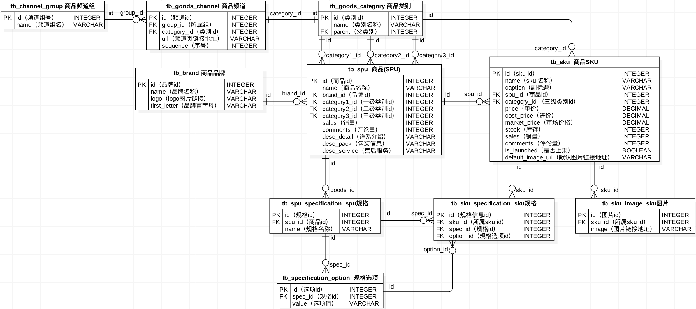
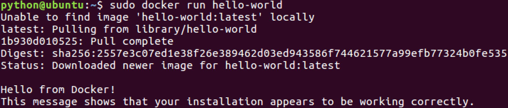
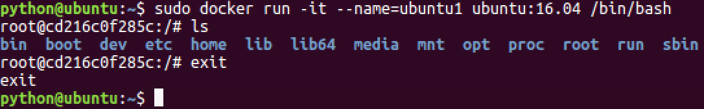
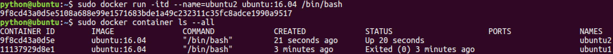

# Product

## 1. Product database table design
### 1.1 SPU and SKU

For merchandise in e-commerce, there are two important concepts: the SPU and the SKU.

#### 1.1.1 Introduction to SPU

**SPU = Standard Product Unit**
 - SPU is the smallest unit of commodity information aggregation, is a set of standardized information that can be taken, easy to retrieve the collection, the collection describes the characteristics of a product.

 - In common parlance, goods with the same attribute values and characteristics can be categorized into one type of SPU.

 - Example:
   - iPhone X is an SPU, independent of merchant, color, style, specification, package, etc.
      

#### 1.1.2 Introduction to SKU

**SKU = Stock Keeping Unit**
 - SKU, the unit of measurement of inventory in and out, can be in pieces, boxes, etc., is the smallest physically indivisible unit of inventory.
 - In layman's terms, a SKU is an item, each with a SKU, which makes it easy for e-commerce brands to identify the item.
 - Example:
   - iPhone X Full Netflix Black 256G is a SKU that indicates specific specifications, colors, and other information.
     

### 1.2 Home Ads Database Table Analysis
#### 1.2.1 Home Ads Database Table Analysis


#### 1.2.2 Define the home page ad model class
[Details](../../lemon_mall/lemon_mall/apps/contents/models.py)
```python
class ContentCategory(BaseModel):
    ...


class Content(BaseModel):
    ...
```
```bash
python3 manage.py makemigrations
python3 manage.py migrate
```

### 1.3 Commodity information database table analysis
#### 1.3.1 Commodity information database table analysis


#### 1.3.2 Define the commodity information model class
```bash
cd lemon_mall
cd apps
python3 ../../manage.py startapp goods
```
[Details](../../lemon_mall/lemon_mall/apps/goods/models.py)
```python
from lemon_mall.utils.models import BaseModel


class GoodsCategory(BaseModel):
    ...


class GoodsChannelGroup(BaseModel):
    ...


class GoodsChannel(BaseModel):
    ...


class Brand(BaseModel):
    ...


class SPU(BaseModel):
    ...


class SKU(BaseModel):
    ...


class SKUImage(BaseModel):
    ...


class SPUSpecification(BaseModel):
    ...


class SpecificationOption(BaseModel):
    ...


class SKUSpecification(BaseModel):
    ...
```
```bash
INSTALLED_APPS = [
    ...
    'goods',  # Goods
]
```
```bash
python3 manage.py makemigrations
python3 manage.py migrate
```

## 2. Preparation of commodity data
 - With the database tables in place, we now need to prepare the product information data and product image data for querying and display.
 - Commodity information data: such as item numbers are of string type and can be stored directly in the MySQL database.
 - Product Image Data: MySQL usually stores the address string information of the image.
   - So the image data needs to be stored physically in some other way.
   
 - Image physical storage thinking:
   - Need to provide mechanisms for image uploads and downloads.
   - Need to solve the problem of image backup and expansion.
   - Need to solve the problem of image renaming and so on.
 - Physical storage solution for images:
   - FastDFS
### 2.1 File storage solution FastDFS
#### 2.1.1 Introduction to FastDFS
 - Written in `c` an open source lightweight distributed file system.
 - Functions include : file storage, file access (file upload, file download), file synchronization, etc., to solve the problem of mass storage and load balancing. Particularly suitable for file-based online services, such as photo album sites, video sites and so on.
 - Tailored for the Internet, it fully considers mechanisms such as redundant backup, load balancing, linear expansion, and focuses on indicators such as high availability and high performance.
 - Can help us build a set of high-performance file server cluster and provide file upload, download and other services.
   
 - **FastDFS architecture** includes `Client`, `Tracker server` and `Storage server`.
   - `Client` requests `Tracker` to upload and download files, and `Tracker` schedules `Storage` to complete the file upload and download.
 - **Client**: Client, the initiator of the business request, uses TCP/IP protocol to interact with `Tracker` or `Storage` through proprietary interfaces, FastDFS provides `upload`, `download`, `delete` and other interfaces for the client to use.
     
 - **Tracker server**: Tracker server, mainly does scheduling work and plays the role of load balancing. It records the status information of all storage groups and storage servers in the cluster in memory, and is the hub of interaction between clients and data servers.
     
 - **Storage server**: storage server (storage node or data server), files and file attributes are saved to the storage server. storage server manages files directly using OS file system calls.
   - The **horizontal** in the Storage cluster can be **expanded** and the **vertical** can be **backed up**.

#### 2.1.2 FastDFS Upload and Download Process


#### 2.1.3 FastDFS file indexing

 - The **FastDFS upload and download processes** can be seen to involve a piece of data called the **file index (file_id)**.
   - **File index (file_id)** is a string returned to the client by Storage after the client uploads a file, which is the index information for accessing the file in the future.
 - File index (file_id) information includes: group name, virtual disk path, data two-level directory, file name and other information.
   - **Group name**: The name of the Storage group where the file is uploaded.
   - **Virtual Disk Path**: The virtual path configured by Storage, corresponding to the disk option `store_path`. `M00` if `store_path0` is configured, `M01` if `store_path1` is configured, and so on.
   - Data two-level directory: a two-level directory created by the Storage Server under each virtual disk path to store data files.
   - File name: Generated by the Storage Server based on specific information, the file name contains information such as:source storage server IP address, file creation timestamp, file size, random number, and file extension name.


### 2.2 Containerization solution Docker
Issues:
 - The installation steps for FastDFS are very numerous and involve a lot of dependent packages, when a new machine needs to install FastDFS, do we need to install it from scratch.
 - After getting an image of the ubuntu system and running this image in a VM virtual machine, why is it possible to develop directly without having to rebuild the development environment.
 - At work, how to efficiently ensure that the development environment in which developers write code is consistent with the production environment in which the application is to be deployed. If a new machine is to be deployed, does it need to be deployed from scratch.

Conclusion:
 - The above reflections all relate to **whether the same work needs to be done over and over again**.
 - Avoiding doing the same work over and over again is one of the containerization technology applications.

Containerization Solutions:
 - **Docker**
 - One of the goals of Docker is to shorten the cycle of code from development and testing to deployment and up and running, making our applications portable, easy to build, and easy to collaborate on.

#### 2.2.1 Introduction to Docker
 - Docker is an open source software deployment solution.
 - Docker is also a lightweight application container framework.
 - Docker can package, distribute, and run any application.
 - Docker is like a box that can contain many objects. If you need certain objects, you can directly take the box away without taking them one by one from the box.
 - Docker is a `client-server (C/S)` architecture program.
   - The client only needs to send a request to the server, and the server will return the result after processing the request.

Docker consists of three basic concepts:
 - Image
   - Docker's concept of an image is similar to that of an image in a virtual machine, a read-only template, a separate filesystem that includes the data needed to run the container and can be used to create new containers.
   - For example, an image can contain a complete ubuntu operating system environment with only MySQL or other applications that the user needs installed.
 - Container
   - Docker containers are running instances created from Docker images, similar to a VM virtual machine, with support for starting, stopping, and deleting.
   - Each container is isolated from each other, the container will run a specific application, contains application-specific code and the required dependency files.
 - Repository
   - Docker's repository function is similar to Github, which is used to host images.

#### 2.2.2 Docker installation (ubuntu 16.04)
1. Installing Docker CE from source
```bash
$ cd docker source code directory
$ sudo apt-key add gpg
$ sudo dpkg -i docker-ce_17.03.2~ce-0~ubuntu-xenial_amd64.deb
```


2. Check that Docker CE is installed correctly
```bash
$ sudo docker run hello-world
```
The following message appears, indicating successful installation:


3. Start and stop
 - After installing Docker, the docker service is already started by default.

```bash
# Start docker
$ sudo service docker start
# Restart docker
$ sudo service docker restart
# Stop docker
$ sudo service docker stop
```

```bash
# MacOS Installation
https://docs.docker.com/desktop/setup/install/mac-install/
```
#### 2.2.3 Docker Image Operation
1. Image list
```bash
$ sudo docker image ls
```

```bash
* REPOSITORY：The name of the repository where the image is located 
* TAG：Image Labeling 
* IMAGEID：Image ID
* CREATED：The date the image was created (not the date the image was fetched) 
* SIZE：Image size
```
2. Pulling images from the repository
```bash
# Official images
$ sudo docker image pull image name or sudo docker image pull library/image name
$ sudo docker image pull ubuntu or sudo docker image pull library/ubuntu
$ sudo docker image pull ubuntu:16.04 or sudo docker image pull library/ubuntu:16.04

# Personal images
$ sudo docker image pull Repository Name/Image Name
$ sudo docker image pull alex/fastdfs
```


3. Delete images
```bash
$ sudo docker image rm image name or image ID
$ sudo docker image rm hello-world
$ sudo docker image rm fce289e99eb9
```


#### 2.2.4 Docker Container Operations
1. Container List
```bash
# View running containers
$ sudo docker container ls
# View all containers
$ sudo docker container ls --all
```


2. Create containers
```bash
$ sudo docker run [option] image name [command to pass into the startup container]
```
```bash
Description of common optional parameters:
* -i Indicates that the container is run in Interactive Mode.
* -t means that the container will enter its command line after startup. By adding these two parameters, the container can be logged in as soon as it is created. This means that a pseudo-terminal is assigned.
* --name Names the container to be created.
* -v Indicates a directory mapping relationship, i.e. host directory:container directory. Note:It's better to do directory mapping, make changes on the host, and then share them to the container. 
* -d creates a daemon container to run in the background (so that you don't automatically log in to the container after it is created). 
* -p means port mapping, i.e. host port:port in container.
* --network=host Indicates mapping the host's network environment to the container, so that the container's network is the same as the host.
```

3. Interactive Containers
```bash
$ sudo docker run -it --name=ubuntu1 ubuntu /bin/bash
```


```text
A container in which we can execute linux commands at will is an ubuntu environment.
When we exit, the container stops.
```

4. Retaining vessel
```bash
# Opening a Guarded Container
$ sudo docker run -dit --name=ubuntu2 ubuntu
```

```bash
# Enter the container's internal interaction environment
$ sudo docker exec -it Container name or container id First command executed after entry
$ sudo docker exec -it ubuntu2 /bin/bash
```

```text
For a container that needs to run for a long time, we can create a daemon container.
The container is stopped when the exit command is executed inside the container.
```
5. Stopping and starting containers
```text
# Stop the container
$ sudo docker container stop container name or container id
# kill the container
$ sudo docker container kill container name or container id
# Start the container
$ sudo docker container start container name or container id
```

6. Deleting containers
 - Running containers cannot be deleted directly.
```text
$ sudo docker container rm container name or container id
```

7. Containers made into image
 - To ensure that the already configured environment can be reused, we can make an image of the container.
```text
# Make an image of the container
$ sudo docker commit container name image name
```

```text
# Pack the image for backup
$ sudo docker save -o saved filename image name
```

```text
# Unpack the image
$ sudo docker load -i file path/backup file
```


### 2.3 Docker and FastDFS Uploading and Downloading Files
#### 2.3.1 Docker installation running FastDFS
1. Getting a FastDFS image
```bash
# Pull the image from the repository
$ sudo docker image pull delron/fastdfs
# Or
# Unpack the local image (*)
$ sudo docker load -i file path/fastdfs_docker.tar
```
2. Start the tracker container
 - We map the tracker run directory to the `/var/fdfs/tracker` directory on the host.
```bash
sudo docker run -dit --name tracker --network=host -v /var/fdfs/tracker:/var/fdfs delron/fastdfs tracker
```


3. Start the storage container
 - TRACKER_SERVER=Tracker's ip address:22122 (do not use 127.0.0.1 for Tracker's ip address)
 - We map the storage run directory to the `/var/fdfs/storage` directory on the host.
```bash
sudo docker run -dti --name storage --network=host -e TRACKER_SERVER=192.168.103.158:22122 -v /var/fdfs/storage:/var/fdfs delron/fastdfs storage
```


4. View host mapped paths


Note: If you are unable to restart the storage container, you can delete the `fdfs_storaged.pid` file in the `/var/fdfs/storage/data` directory and re-run storage.


#### 2.3.2 FastDFS Client Uploading Files
1. Installing the FastDFS Client Extension
```bash
# Old version:
$ pip install fdfs_client-py-master.zip
$ pip install mutagen
$ pip isntall requests

# New version:
$ pip install fastdfs-client
```
2. Preparing configuration files for FastDFS client extensions
 - lemon_mall.utils.fastdfs.client.conf
   
```bash
base_path=Directory where FastDFS clients store log files
tracker_server=Machine running Tracker service ip:22122
```
3. FastDFS client implementation for file storage
```bash
# Using the shell to enter the Python interactive environment
$ python manage.py shell
```
```python
from fastdfs_client import FastdfsClient

client = FastdfsClient('/etc/fdfs/client.conf')
ret = client.upload_by_filename('test.txt')
print(ret)

"""
ret = {
   'Group name': 'group1',
   'Remote file_id': 'group1/M00/00/00/wKhnnlxw_gmAcoWmAAEXU5wmjPs35.jpeg',
   'Status': 'Upload successed.',
   'Local file name': 'text.txt',
   'Uploaded size': '69.00KB',
   'Storage IP': '192.168.103.158'
 }
"""
```


```bash
# No space left on device
sudo docker exec -it tracker /bin/bash
cd /etc/fdfs/
vi tracker.conf

reserved_storage_space = 1%

sudo docker container stop tracker
sudo docker container start tracker
```
#### 2.3.3 Enter product data and image data
1. SQL script to enter product data
```bash
# $ mysql -h127.0.0.1 -uroot -pmysql lemonmall < File path/goods_data.sql

$ mysql -h127.0.0.1 -ualex -p123456abcdefg lemonmall < goods_data.sql 
```
2. FastDFS server to enter image data
 - Prepare a new image data compression package
   
 - Delete the old data directory in `Storage`
   
 - Copy the new image data package to Storage and unzip it.
   ```bash
   # Unzip command
   sudo tar -zxvf data.tar.gz
   ```
   
 - View the new `data` directory
   
   

## 3. Home Ads
### 3.1 Showcase HomeProductsChannel Categories
#### 3.1.1 Analyze the data structure of homepage product channel classification
```json
{
    "1":{
        "channels":[
            {"id":1, "name":"手机", "url":"http://shouji.jd.com/"},
            {"id":2, "name":"相机", "url":"https://www.google.com/"}
        ],
        "sub_cats":[
            {
                "id":38, 
                "name":"手机通讯", 
                "sub_cats":[
                    {"id":115, "name":"手机"},
                    {"id":116, "name":"游戏手机"}
                ]
            },
            {
                "id":39, 
                "name":"手机配件", 
                "sub_cats":[
                    {"id":119, "name":"手机壳"},
                    {"id":120, "name":"贴膜"}
                ]
            }
        ]
    },
    "2":{
        "channels":[],
        "sub_cats":[]
    }
}
```
#### 3.1.2 Check the category of the product channel on the home page
```python
class IndexView(View):
   """Home Advertisement"""
   def get(self, request):
      """Provide homepage advertisement page"""
      # Search and display product categories
      # Prepare dictionaries corresponding to product categories
      categories = OrderedDict()
      # Check all product channels: 37 first level categories
      channels = GoodsChannel.objects.order_by('group_id', 'sequence')
      # Iterate over all channels
      for channel in channels:
         # Get the group of the current channel
         group_id = channel.group_id
         # Constructing a basic data framework: Only 11 groups
         if group_id not in categories:
            categories[group_id] = {
               'channels': [],
               'sub_cats': []
            }

         # Query the first level category corresponding to the current channel
         cat1 = channel.category
         # Add cat1 to channels
         categories[group_id]['channels'].append({
            'id': cat1.id,
            'name': cat1.name,
            'url': channel.url
         })

         # Query secondary and tertiary categories
         for cat2 in cat1.subs.all():    # Finding secondary categories from primary categories
            cat2.sub_cats = []  # Add a list to the secondary category that holds the tertiary category
            for cat3 in cat2.subs.all():    # Finding a tertiary category from a secondary category
               cat2.sub_cats.append(cat3)  # Adding third-level categories to second-level

            # Add secondary category to primary category sub_cats
            categories[group_id]['sub_cats'].append(cat2)

      # Construct context
      context = {
         'categories': categories
      }
      return render(request, 'index.html', context)
```
#### 3.1.3 Render home page product channel categories
```html
<ul class="sub_menu">
    
    <li>
        <div class="level1">
            
            <a href="{{ channel.url }}">{{ channel.name }}</a>
            
        </div>
        <div class="level2">
            
            <div class="list_group">
                <div class="group_name fl">{{ cat2.name }} &gt;</div>
                <div class="group_detail fl">
                    
                    <a href="/list/{{ cat3.id }}/1/">{{ cat3.name }}</a>
                    
                </div>
            </div>
            
        </div>
    </li>
    
</ul>
```
### 3.2 Display home page product ads
#### 3.2.1 Search for product ads on the home page
```python
class IndexView(View):
    """Home Advertisement"""
    def get(self, request):
        ...

        # Check homepage advertisement data
        # Check all advertisement categories
        contents = OrderedDict()
        content_categories = ContentCategory.objects.all()
        for content_category in content_categories:
            contents[content_category.key] = content_category.content_set.filter(status=True).order_by('sequence')   # Check out and sort the unlisted ads

        # Use the advertisement category to find out the content of all advertisements corresponding to the category.

        # Construct context
        context = {
            'categories': categories,
            'contents': contents
        }
        return render(request, 'index.html', context)
```
#### 3.2.2 Render home page product ads
rotating chart advertisement
```html
<ul class="slide">
    
    <li><a href="{{ content.url }}"></a></li>
    
</ul>
```
Newsletters and header ads

Floor advertising (first floor)

Floor advertising (second floor)

Floor advertising (third floor)

### 3.3 Custom Django File Storage Classes
The 'Remote file_id' field returned after uploading a file via FastDFS is the file index.

The file index is stored in our MySQL database. So what will be read out in the future will also be the file index, resulting in the interface not being able to download the image.

Solution:

 - Rewrite the url() method of the Django file storage class.
 - Splicing the full image download address (protocol, IP, port, file index) in the rewrite

#### 3.3.1 Django file storage class url() method introduction

Conclusion:

 - What the file storage class `url()` method does: returns the URL of the file content represented by `name`.

 - The trigger for the file storage class url() method: `content.image.url`
   - Although the `url` method of `ImageField` is called on the surface. But internally, it will call the url() method of the file storage class.

 - Usage of file storage class `url()` method:
   - We can customize Django file storage class for the purpose of overriding the `url()` method.
   - The custom Django file storage class must provide the `url()` method.
   - It returns the absolute URL of the file referred to by name.
#### 3.3.2 Custom Django File Storage Classes
Rewriting the url() method of the Django file storage class
```python
class FastDFSStorage(Storage):
    """Customized File Storage Classes"""
    def __init__(self, fdfs_base_url=None):
        # if not fdfs_base_url:
        #     self.fdfs_base_url = settings.FDFS_BASE_URL
        # self.fdfs_base_url = fdfs_base_url
        self.fdfs_base_url = fdfs_base_url or settings.FDFS_BASE_URL

    def _open(self, name, mode='rb'):
        """which is called when opening a file and must be overridden."""
        # Since we are not currently opening a file, this method is currently useless, but it must be rewritten, so pass
        pass

    def _save(self, name, content):
        """which will be called when the file is saved"""
        # Because it's not currently going to save the file.
        pass

    def url(self, name):
        """Returns the full path of the file"""
        return self.fdfs_base_url + name
```
```bash
# Specify a custom Django file storage class
STORAGES = {
    "default": {
        "BACKEND": 'lemon_mall.utils.fastdfs.fdfs_storage.FastDFSStorage',
    },
    "staticfiles": {
        "BACKEND": "django.contrib.staticfiles.storage.StaticFilesStorage",
    },
}

# FastDFS related parameters
FDFS_BASE_URL = 'http://192.168.112.134:8888/'
```
```html
<ul class="slide">
    
    <li><a href="{{ content.url }}"></a></li>
    
</ul>
```

## 4. Product List Page
### 4.1 Product Listing Page Interface Design and Definition
Request method

Option| Program
---|---|
Request Method|GET
Request address|/list/(?P<category_id>\d+)/(?P<page_num>\d+)/?sort=Sorting method

```text
# Sort by product creation time
.../list/115/1/?sort=default
# Sort items by price from lowest to highest
.../list/115/1/?sort=price
# Sort by product sales in descending order
.../list/115/1/?sort=hot
```

Request parameters: path parameters and query parameters

Parameter name | Type | Must be passed or not| Description 
---|---|---|---|
category_id|string|Yes|Commodity Classification ID, Tertiary Classification
page_num|string|Yes|Current page number
sort|string|Yes|Sorting method

Response result: HTML
```html
list.html
```

Interface definition
```python
class ListView(View):

    def get(self, request, category_id, page_num):
        return render(request, 'list.html')
```

### 4.2 List page breadcrumb navigation
1. Query list page breadcrumb navigation data
```python
# goods.utils.py
def get_breadcrumb(category):
   breadcrumb = dict(
      cat1='',
      cat2='',
      cat3=''
   )
   if category.parent is None:
      # First level
      breadcrumb['cat1'] = category
   elif category.subs.count() == 0:
      # Third level
      breadcrumb['cat3'] = category
      cat2 = category.parent
      breadcrumb['cat2'] = cat2
      breadcrumb['cat1'] = cat2.parent
   else:
      # Second level
      breadcrumb['cat2'] = category
      breadcrumb['cat1'] = category.parent

   return breadcrumb
```

```python
class ListView(View):

    def get(self, request, category_id, page_num):
        try:
            category = models.GoodsCategory.objects.get(id=category_id)
        except models.GoodsCategory.DoesNotExist:
            return http.HttpResponseNotFound('GoodsCategory does not exist')

        categories = get_categories()
        breadcrumb = get_breadcrumb(category)

        context = {
            'categories':categories,
            'breadcrumb':breadcrumb
        }
        return render(request, 'list.html', context)
```

2. Render the list page breadcrumb navigation data
```html
<div class="breadcrumb">
    <a href="{{ breadcrumb.cat1.url }}">{{ breadcrumb.cat1.name }}</a>
    <span>></span>
    <a href="javascript:;">{{ breadcrumb.cat2.name }}</a>
    <span>></span>
    <a href="javascript:;">{{ breadcrumb.cat3.name }}</a>
</div>
```

### 4.3 List page paging and sorting
#### 4.3.1 Query list page paging and sorting data
```python
class ListView(View):
    """Product List Page"""
    def get(self, request, category_id, page_num):
        ...

        # Pagination and sorted queries: category query sku, a query for multiple, one-sided model objects. Multi-party associated fields.all/filter
        skus = category.sku_set.filter(is_launched=True).order_by(sort_field)

        # Creating a Paginator
        # Paginator('Data to be paged', 'Number of records per page')
        paginator = Paginator(skus, 5)  # Pagination of skus with 5 records per page
        try:
            # Get the page the user is currently looking at(Core data)
            page_skus = paginator.page(page_num)    # Gets the five records in the page_nums page.
        except EmptyPage:
            return http.HttpResponseNotFound('Empty Page')

        # Get Total Pages: The front-end paging plugin requires the use
        total_page = paginator.num_pages

        # construct a context
        context = {
            'categories': categories,
            'breadcrumb': breadcrumb,
            'page_skus': page_skus,
            'total_page': total_page,
            'page_num': page_num,
            'sort': sort,
            'category_id': category_id
        }
        return render(request, 'list.html', context)
```

#### 4.3.2 Render list page paging and sorting data
```html
<div class="r_wrap fr clearfix">
    <div class="sort_bar">
        <a href="{{ url('goods:list', args=(category.id, page_num)) }}?sort=default" class="active">默认</a>
        <a href="{{ url('goods:list', args=(category.id, page_num)) }}?sort=price" class="active">价格</a>
        <a href="{{ url('goods:list', args=(category.id, page_num)) }}?sort=hot" class="active">人气</a>
    </div>
    <ul class="goods_type_list clearfix">
        
        <li>
        <a href="detail.html"></a>
        <h4><a href="detail.html">{{ sku.name }}</a></h4>
        <div class="operate">
            <span class="price">￥{{ sku.price }}</span>
            <span class="unit">台</span>
            <a href="#" class="add_goods" title="加入购物车"></a>
        </div>
        </li>
        
    </ul>
   <div class="pagenation">
      <div id="pagination" class="page"></div>
   </div>
</div>
```

```html
<link rel="stylesheet" type="text/css" href="{{ static('css/jquery.pagination.css') }}">

<script type="text/javascript" src="{{ static('js/jquery.pagination.min.js') }}"></script>

<script type="text/javascript">
    $(function () {
        $('#pagination').pagination({
            currentPage: {{ page_num }},
            totalPage: {{ total_page }},
            callback:function (current) {
                {#location.href = '/list/115/1/?sort=default';#}
                location.href = '/list/{{ category.id }}/' + current + '/?sort={{ sort }}';
            }
        })
    });
</script>
```

### 4.4 List Page Top Sellers
#### 4.4.1 Query list page hot ranking data
Request method

Option| Program
---|---|
Request Method|GET
Request address|/hot/(?P<category_id>\d+)/


Request parameters: path parameters

Parameter name | Type | Must be passed or not| Description 
---|---|---|---|
category_id|string|Yes|Commodity Classification ID, Tertiary Classification

Response result: JSON

Response results| Response content
---|---|
code|status code
errmsg|error message
hot_skus[]	|Hot SKU List
id	|SKU number
default_image_url|	Product Default Image
name	|Product Name
price	|Commodity price

```python
class HotGoodsView(View):

    def get(self, request, category_id):
        skus = models.SKU.objects.filter(category_id=category_id, is_launched=True).order_by('-sales')[:2]

        hot_skus = []
        for sku in skus:
            hot_skus.append({
                'id':sku.id,
                'default_image_url':sku.default_image.url,
                'name':sku.name,
                'price':sku.price
            })

        return http.JsonResponse({'code':RETCODE.OK, 'errmsg':'OK', 'hot_skus':hot_skus})
```

#### 4.4.2 Rendering list page hot ranking data
```html
<script type="text/javascript">
    let category_id = "{{ category.id }}";
</script>

data: {
    category_id: category_id,
},

get_hot_skus(){
  ...
},

<div class="new_goods" v-cloak>
   <h3>热销排行</h3>
   <ul>
      <li v-for="sku in hot_skus">
         <a :href="sku.url"></a>
         <h4><a :href="sku.url">[[ sku.name ]]</a></h4>
         <div class="price">￥[[ sku.price ]]</div>
      </li>
   </ul>
</div>
```
## 5. Product Search
### 5.1 Full-text search solution ElasticSearch
#### 5.1.1 Principles of full-text retrieval and search engines
Product Search Requirements

 - When a user enters a product keyword in the search box, we want to provide the user with relevant product search results.

Product Search Implementation

 - We can choose to use the fuzzy query `like` keyword to implement.
 - However, the `like` keyword is extremely inefficient.
 - The query needs to be performed on multiple fields and it is not convenient to use the `like` keyword.

Full-text search scheme

 - We introduce a **full-text search** scheme to realize product search.
 - Full-text search means to search in any specified field.
 - The full-text search scheme needs to be realized with a search engine.

Search Engine Principles
 - **Search engine** for full-text search, the data in the database will be pre-processed once, a separate index structure data.
 - The index structure data is similar to the index search page of the Xinhua Dictionary, which contains the keywords and the corresponding relationship between the entries, and record the location of the entries. 
 - Search engine for full-text search, the keywords in the index data for rapid comparison and search, and then find the real storage location of the data.

Conclusion:
 - Search engine to build index structure data, similar to the index search page of the Xinhua Dictionary, full-text search, keywords in the index data for rapid comparison to find, and then find the real storage location of the data.

#### 5.1.2 Introduction to Elasticsearch
The search engine of choice for full-text search is **Elasticsearch**.

 - `Elasticsearch` is implemented in Java , open source search engine .
 - It can store, search and analyze huge amounts of data quickly. Wikipedia, Stack Overflow, Github and so on are using it.
 - Elasticsearch is based on the open source library `Lucene`. However, we can not use Lucene directly, we must write our own code to call its interface.

Segmentation Explained

 - Search engines need to perform word splitting when indexing data.
 - Lexicalization is the process of breaking a sentence into **multiple words** or **phrases** that are keywords for that sentence.
 - Elasticsearch does not support indexing Chinese words, we need to extend `elasticsearch-analysis-ik` to realize Chinese word processing.

#### 5.1.3 Install Elasticsearch with Docker
1. Get an Elasticsearch-ik Mirror
```bash
# Pull mirrors from the repository
$ sudo docker image pull delron/elasticsearch-ik:2.4.6-1.0
# Unzip the local image
$ sudo docker load -i elasticsearch-ik-2.4.6_docker.tar
```
2. Configure Elasticsearch-ik
 - Copy the `elasticsearc-2.4.6` directory to the home directory.
 - Modify `/home/python/elasticsearc-2.4.6/config/elasticsearch.yml` line 54.
 - Change the ip address to the local real ip address.


3. Run Elasticsearch-ik with Docker
```bash
$ sudo docker run -dti --name=elasticsearch --network=host -v /home/python/elasticsearch-2.4.6/config:/usr/share/elasticsearch/config delron/elasticsearch-ik:2.4.6-1.0
```


### 5.2 Haystack extension builds indexes
The underlying layer of `Elasticsearch` is the open source library `Lucene`, but we can't use Lucene directly, we have to write your own code to call its interface.

How do we interface with the Elasticsearch server?
 - **Haystack**

#### 5.2.1 Haystack Introduction and Installation Configuration
1. Introduction to Haystack

Haystack is a framework for interfacing with search engines in Django, building a bridge between users and search engines.
 - We can use Haystack to call Elasticsearch search engine in Django.

Haystack can use different search backends (such as `Elasticsearch`, `Whoosh`, `Solr`, etc.) without modifying the code.

2. Haystack Installation

```bash
$ pip3 install django-haystack
$ pip3 install elasticsearch==2.4.1
```

3. Haystack registers applications and routes
```python
# dev.py
INSTALLED_APPS = [
    'haystack', # Full text search
]
```
```python
# urls.py
re_path(r'^search/', include('haystack.urls')),
```

4. Haystack Configuration
 - Configure Haystack as a search engine backend in the configuration file

```python
# Haystack
HAYSTACK_CONNECTIONS = {
    'default': {
        'ENGINE': 'haystack.backends.elasticsearch_backend.ElasticsearchSearchEngine',
        'URL': 'http://192.168.112.134:9200/', # Elasticsearch server ip address, port number fixed to 9200
        'INDEX_NAME': 'lemon_mall', # Name of the index repository created by Elasticsearch
    },
}

# Automatic index generation when adding, modifying, or deleting data
HAYSTACK_SIGNAL_PROCESSOR = 'haystack.signals.RealtimeSignalProcessor'
```

Important Tip:

 - The `HAYSTACK_SIGNAL_PROCESSOR` configuration item ensures that when Django is up and running and new data is being generated, Haystack will still allow Elasticsearch to index the new data in real time!

#### 5.2.2 Haystack builds data indexes
1. Create Index Classes

 - Indicate which fields to let the search engine index by creating an index class, that is, which fields' keywords can be used to retrieve the data.
 - Full-text search of SKU information is performed in this project, so a new `search_indexes.py` file is created in the `goods` app to hold the index classes.

```python
from haystack import indexes

from .models import SKU


class SKUIndex(indexes.SearchIndex, indexes.Indexable):
    """SKU Index Data Model Class"""
    # Receive Index Fields, defining Index Fields with Documents, and rendered using the template syntax
    text = indexes.CharField(document=True, use_template=True)

    def get_model(self):
        """Returns the indexed model class"""
        return SKU

    def index_queryset(self, using=None):
        """Returns the query set of data to be indexed"""
        return self.get_model().objects.filter(is_launched=True)
```

Description of indexing class SKUIndex:
 - The fields established in `SKUIndex` can be queried with the help of `Haystack` by `Elasticsearch` search engine.
 - The `text` field we declare as `document=True`, the table name of the field is the main keyword query field.
 - `text` field index value can be composed of more than one database model class fields, specifically by which model class fields, we use `use_template=True` to indicate the follow-up through the template to indicate.

2. Create `text` field index value template file
 - Create the template file used by the `text field` in the `templates` directory
 - Specifically defined in the file `templates/search/indexes/goods/sku_text.txt`
```text
{{ object.id }}
{{ object.name }}
{{ object.caption }}
```
Template file description: when passing keywords through the text parameter name
 - This template specifies the `id`, `name`, and `caption` of the SKU as the index value of the `text` field for keyword indexing queries.

3. Manual generation of the initial index
```bash
$ python manage.py rebuild_index
```


#### 5.2.3 Full-text search test
1. Preparing Test Forms
 - Request method: GET
 - Request address: /search/
 - Request parameter: q

```html
<div class="search_wrap fl">
    <form method="get" action="/search/" class="search_con">
        <input type="text" class="input_text fl" name="q" placeholder="搜索商品">
        <input type="submit" class="input_btn fr" name="" value="搜索">
    </form>
    <ul class="search_suggest fl">
        <li><a href="#">索尼微单</a></li>
        <li><a href="#">优惠15元</a></li>
        <li><a href="#">美妆个护</a></li>
        <li><a href="#">买2免1</a></li>
    </ul>
</div>
```

2. Full text search test results

TemplateDoesNotExist at /search/
 - The error tells us that a `search.html` file is missing from the `templates/search/` directory.
 - The `search.html` file is used to receive and render the results of a full-text search.

### 5.3 Render product search results
#### 5.3.1 Prepare product search results page


#### 5.3.2 Render product search results

The data returned by Haystack includes:
 - query: search keywords
 - paginator: paging paginator object
 - page: the current page of the page object (traversing the objects in the `page`, you can get the `result` object)
 - result.objects: the current traversal out of the SKU object.
```html
<div class="main_wrap clearfix">
    <div class=" clearfix">
        <ul class="goods_type_list clearfix">
            
            <li>
                {# The object is the sku object. #}
                <a href="/detail/{{ result.object.id }}/"></a>
                <h4><a href="/detail/{{ result.object.id }}/">{{ result.object.name }}</a></h4>
                <div class="operate">
                    <span class="price">￥{{ result.object.price }}</span>
                    <span>{{ result.object.comments }}评价</span>
                </div>
            </li>
            
                <p>没有找到您要查询的商品。</p>
            
        </ul>
        <div class="pagenation">
            <div id="pagination" class="page"></div>
        </div>
    </div>
</div>
```

#### 5.3.3 Haystack search result pagination
1. Set the number of data items returned per page
 - `HAYSTACK_SEARCH_RESULTS_PER_PAGE` allows you to control the number of displays per page. 
 - Five data per page: `HAYSTACK_SEARCH_RESULTS_PER_PAGE = 5`

2. Prepare a search page pager
```html
<div class="main_wrap clearfix">
    <div class=" clearfix">
        ......
        <div class="pagenation">
            <div id="pagination" class="page"></div>
        </div>
    </div>
</div>

<script type="text/javascript">
    $(function () {
        $('#pagination').pagination({
            currentPage: {{ page.number }},
            totalPage: {{ paginator.num_pages }},
            callback:function (current) {
                {#window.location.href = '/search/?q=iphone&amp;page=1';#}
                window.location.href = '/search/?q={{ query }}&page=' + current;
            }
        })
    });
</script>
```

